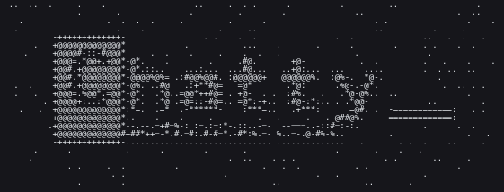

# selfhost chat
<p align="center">
  
</p>

Минималистичный чат на Ollama Cloud API (ollama.com): стриминг, tool calling,
память-заметки, простая авторизация на одного пользователя и дашборд токенов
с **реальными** цифрами (`prompt_eval_count` / `eval_count` Ollama отдаёт сама).

Бэкенд — FastAPI + SQLite; фронта пока нет (`frontend/` — скелет, можно не собирать:
API полностью работает сам по себе).

## Быстрый старт

```bash
cp .env.example .env
./run.sh          # бэкенд; APP_PORT берётся из .env (по умолчанию 8000)
```

При первом запуске в `.env` допишутся автосгенерированные `SECRET_KEY` и
`AUTH_PASSWORD` — пароль печатается в терминал, это логин. В `.env` один
обязательный ключ:

1. ключ на https://ollama.com/settings/keys
2. `OLLAMA_API_KEY=...` в `.env`

Приложение: http://localhost:8000 — на `/` смоук-консоль (пока фронтенд не
собран): вход, кнопки проверки API и raw-стрим чата. Всё под `/api` — под
cookie после `POST /api/auth/login {"password": ...}`. Собранный SPA
(`RUN_FRONTEND=1 ./run.sh` или `npm --prefix frontend run build`) замещает
консоль автоматически.

**Порт.** Если APP_PORT занят (на этой машине его держит системная служба
`jupyterhub.service`, порт 8000 — её порт по умолчанию), run.sh перескакивает
на ближайший свободный и печатает адрес. Чтобы адрес не плавал, закрепи порт в
`.env`: `APP_PORT=8001`. Убить узуратора навсегда (он нужен JupyterHub, не нам):
`sudo systemctl disable --now jupyterhub`.

## Smoke-test через curl

```bash
curl -sc cookies.txt -X POST localhost:8000/api/auth/login \
     -d '{"password":"<пароль из .env>"}' -H 'content-type: application/json'
curl -sb cookies.txt -X POST localhost:8000/api/chat -N \
     -d '{"model":"gpt-oss:120b","content":"привет","use_tools":false}' \
     -H 'content-type: application/json'
curl -sb cookies.txt localhost:8000/api/models
curl -sb cookies.txt localhost:8000/api/stats/summary
```

`-N` обязательно: ответ — NDJSON построчно (`{"t":"delta",...}` → `usage` → `done`),
каждый ход это отдельный upstream-вызов с реальными токенами.

## Данные и бэкап

Всё состояние — `data/chat.db` (SQLite, WAL). Бэкап = скопировать файл
(лучше парой `checkpoint`: `sqlite3 data/chat.db "PRAGMA wal_checkpoint;"`).

## Разработка

```bash
./run.sh                                                  # весь проект одной командой
./dev.sh                                                  # dev: uvicorn --reload + vite (hot-reload)
.venv/bin/python -m unittest discover -s tests            # тесты (мок-апстрим, без ключа)
```

## Production

Собственно HTTPS наружу — через caddy/nginx reverse-proxy перед uvicorn и
`COOKIE_SECURE=true` в `.env`.
